  
  
  
  
  

 

<picture>
  <source media="(prefers-color-scheme: dark)" srcset="assets/chapter-1-dark.svg">
  
</picture>

 

<picture>
  <source media="(prefers-color-scheme: dark)" srcset="assets/chapter-2-dark.svg">
  
</picture>

  
  

  
  

  
  

 

<picture>
  <source media="(prefers-color-scheme: dark)" srcset="assets/chapter-3-dark.svg">
  
</picture>

 

<picture>
  <source media="(prefers-color-scheme: dark)" srcset="assets/chapter-4-dark.svg">
  
</picture>

  

<picture>
  <source media="(prefers-color-scheme: dark)" srcset="assets/quote-dark.svg">
  
</picture>

 

<picture>
  <source media="(prefers-color-scheme: dark)" srcset="assets/chapter-5-dark.svg">
  
</picture>

<a href="https://arshchatrath.me">
<picture>
  <source media="(prefers-color-scheme: dark)" srcset="assets/neko-dark.svg">
  
</picture>
</a>
