  
  
  
  
  

 

<picture>
  <source media="(prefers-color-scheme: dark)" srcset="assets/chapter-1-dark.svg">
  
</picture>

🎓 CSBS undergrad @ **Thapar University**  
🚀 Founding Product & Growth Associate at **[Talkeys](https://talkeys.xyz)**, a community-first college event & networking platform  
🛠️ I love bringing ideas to life through sleek UI/UX and scalable front-end solutions  
🌱 Currently exploring product thinking, startup culture & community-focused tech

 

<picture>
  <source media="(prefers-color-scheme: dark)" srcset="assets/chapter-2-dark.svg">
  
</picture>

- 🧩 Product Design & Strategy
- ✨ UI/UX & Frontend Development
- 🧠 Community Building & EduTech
- 🎯 Marketing & Digital Experience Design

 

<picture>
  <source media="(prefers-color-scheme: dark)" srcset="assets/chapter-3-dark.svg">
  
</picture>

  

Thanks for stopping by! 🌟

<picture>
  <source media="(prefers-color-scheme: dark)" srcset="assets/chapter-4-dark.svg">
  
</picture>

<picture>
  <source media="(prefers-color-scheme: dark)" srcset="assets/neko-dark.svg">
  
</picture>
